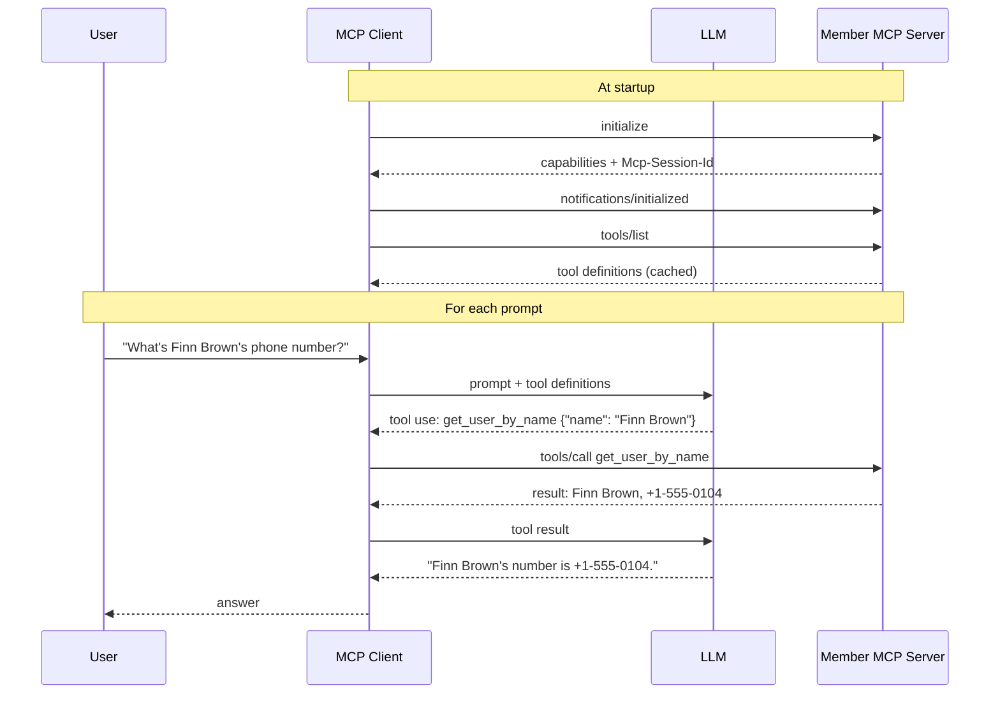

# MCP Client-Server Data Transfer

How an AI client (for example Claude Code) finds, chooses and calls the tools on the Member MCP Server. The examples use `get_user_by_name`.

## Contents

1. [Roles](#1-roles)
2. [How the client finds out about tools](#2-how-the-client-finds-out-about-tools)
3. [How the LLM chooses a tool](#3-how-the-llm-chooses-a-tool)
4. [Tool schema: get_user_by_name](#4-tool-schema-get_user_by_name)
5. [Calling the tool over the wire](#5-calling-the-tool-over-the-wire)
6. [End-to-end sequence](#6-end-to-end-sequence)
7. [Practical notes](#7-practical-notes)

---

## 1. Roles

| Component | Example | What it does |
|---|---|---|
| User | A person typing in the client | Asks a question in plain language |
| MCP client (host) | Claude Code | Connects to MCP servers, talks to the LLM, runs tool calls |
| LLM | Claude | Decides which tool to call and with what arguments |
| MCP server | This project, at `http://127.0.0.1:8000/mcp` | Lists its tools and runs them when asked |

The LLM decides which tool to use, but it never talks to the MCP server. All MCP traffic goes through the client. The server doesn't know which LLM is on the other end.

---

## 2. How the client finds out about tools

The client doesn't choose tools per prompt. It learns about all tools ahead of time and sends every definition to the LLM with each prompt.

### Step 1: Configuration

You register the server with the client once:

```
claude mcp add --transport http member-mcp http://127.0.0.1:8000/mcp
```

This saves the server's name and URL in the client's config (for example `.mcp.json` or `~/.claude.json`).

### Step 2: Connection and discovery

When the client starts (or when a server is added), it does this for each configured server:

1. Sends `initialize`, which opens a session. The server returns an `Mcp-Session-Id` header.
2. Sends `notifications/initialized`.
3. Sends `tools/list` and gets back every tool's name, description, `inputSchema` and `outputSchema`.

The client caches the tool list. If a server's tools change later, the server can send `notifications/tools/list_changed` and the client calls `tools/list` again.

### Step 3: Each prompt

When the user types a prompt, the client builds one request to the LLM that includes:

- the system prompt
- the conversation so far
- the definitions of all available tools: built-in ones plus every tool from every connected MCP server
- the new user prompt

The client does no filtering based on what the user typed.

To avoid name clashes between servers, the client prefixes tool names. In Claude Code, `get_user_by_name` appears to the LLM as `mcp__member-mcp__get_user_by_name`.

### Loading tools on demand

When there are many tools, sending every full schema with every prompt uses up a lot of context. Claude Code can defer MCP tools instead:

- Only the tool names go to the LLM up front.
- When the LLM needs a tool, it calls a search tool (`ToolSearch`) to load that tool's full schema, then calls the tool.

In `/context` output, these tools are listed under "MCP tools" as "(loaded on-demand)".

---

## 3. How the LLM chooses a tool

The LLM only sees each tool's name, description and input schema. It matches the user's request against those.

| User prompt | Tool chosen | Arguments |
|---|---|---|
| "What's Finn Brown's phone number?" | `get_user_by_name` | `{"name": "Finn Brown"}` |
| "Who owns fiona.johnson@example.com?" | `get_user_by_email` | `{"email": "fiona.johnson@example.com"}` |
| "List all members" | `get_all_users` | `{}` |

### Who does what

| Step | Who | What happens |
|---|---|---|
| 1 | MCP client | Calls `tools/list` on your server and gets the name, description and `inputSchema` of each tool. |
| 2 | MCP client | Passes those tool definitions to the LLM along with the user's prompt. |
| 3 | LLM | Reads the prompt and the tool descriptions, then decides whether a tool is needed and which one. |
| 4 | LLM | Returns a tool-use request, e.g. `get_user_by_name` with `{"name": "Finn Brown"}`. |
| 5 | MCP client | Turns that into a JSON-RPC `tools/call` and sends it as a POST to `/mcp`. |
| 6 | MCP server | Runs `get_user_by_name` and returns the result. |
| 7 | MCP client | Passes the result back to the LLM. |
| 8 | LLM | Uses the result to write its answer. It may call another tool first. |

The descriptions come from the function docstrings in `src/member_mcp/server.py`. Clear, specific docstrings lead to better tool choices.

---

## 4. Tool schema: get_user_by_name

FastMCP builds the schema from the Python function signature:

```python
@mcp.tool
def get_user_by_name(name: str) -> Member | None:
    """Return the member with the given full name (case-insensitive), or null if not found."""
```

- `name: str` becomes `inputSchema`.
- `Member | None` becomes `outputSchema`.

MCP requires structured output to be a JSON object, so FastMCP wraps the `Member | None` return value in a `result` field.

The tool definition as returned by `tools/list`:

```json
{
  "name": "get_user_by_name",
  "title": "Get User By Name",
  "description": "Return the member with the given full name (case-insensitive), or null if not found.",
  "inputSchema": {
    "type": "object",
    "properties": {
      "name": { "type": "string" }
    },
    "required": ["name"],
    "additionalProperties": false
  },
  "outputSchema": {
    "type": "object",
    "properties": {
      "result": {
        "anyOf": [
          {
            "type": "object",
            "description": "A member record.",
            "properties": {
              "name":   { "type": "string" },
              "email":  { "type": "string" },
              "mobile": { "type": "string" }
            },
            "required": ["name", "email", "mobile"]
          },
          { "type": "null" }
        ]
      }
    },
    "required": ["result"],
    "x-fastmcp-wrap-result": true
  }
}
```

---

## 5. Calling the tool over the wire

The transport is Streamable HTTP. Every message is a JSON-RPC 2.0 message sent as an HTTP POST to `/mcp`.

### Request: `tools/call`

```http
POST /mcp HTTP/1.1
Host: 127.0.0.1:8000
Content-Type: application/json
Accept: application/json, text/event-stream
Mcp-Session-Id: <id returned by the server during initialize>
```

```json
{
  "jsonrpc": "2.0",
  "id": 2,
  "method": "tools/call",
  "params": {
    "name": "get_user_by_name",
    "arguments": { "name": "finn brown" }
  }
}
```

The server can reply as plain JSON or as an SSE stream (`text/event-stream`). That's why the client's `Accept` header lists both.

### Response: member found

The name match ignores case, so `"finn brown"` finds `Finn Brown`:

```json
{
  "jsonrpc": "2.0",
  "id": 2,
  "result": {
    "content": [
      {
        "type": "text",
        "text": "{\"name\":\"Finn Brown\",\"email\":\"finn.brown@example.com\",\"mobile\":\"+1-555-0104\"}"
      }
    ],
    "structuredContent": {
      "result": {
        "name": "Finn Brown",
        "email": "finn.brown@example.com",
        "mobile": "+1-555-0104"
      }
    },
    "isError": false
  }
}
```

| Field | Purpose |
|---|---|
| `content` | Text version, for clients that only read text |
| `structuredContent` | Typed version that matches `outputSchema` |
| `isError` | `true` if the tool raised an error |

### Response: member not found

```json
"structuredContent": { "result": null }
```

---

## 6. End-to-end sequence



---

## 7. Practical notes

- The LLM only sees tool names, descriptions and schemas. Well-written docstrings are the main way to steer which tool it picks.
- The server only receives `tools/call` requests from the client. It never talks to the LLM.
- Tool changes on the server reach the client through `tools/list`, either on reconnect or after a `notifications/tools/list_changed` message.
- To register this server with Claude Code: `claude mcp add --transport http member-mcp http://127.0.0.1:8000/mcp`. Run `/mcp` inside Claude Code to check the connection.
